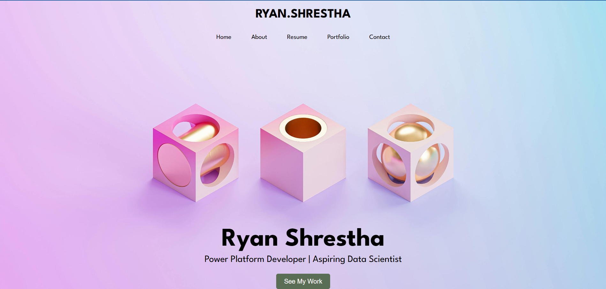
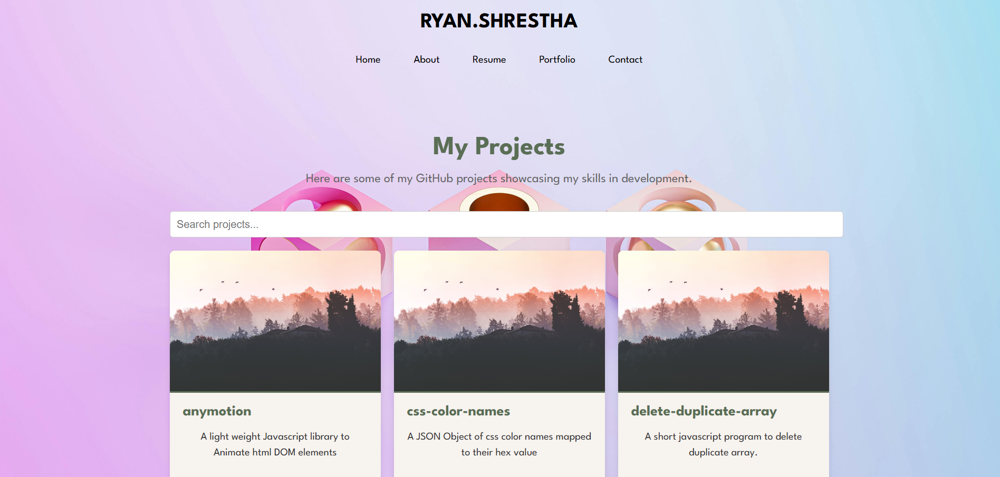
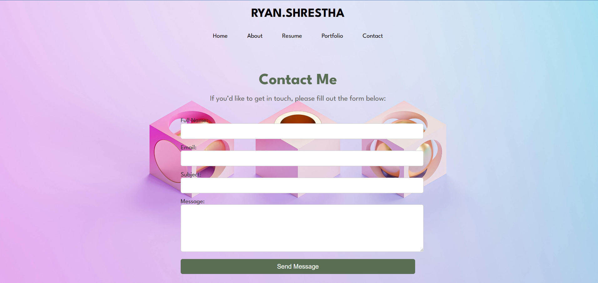

# Portfolio Website

A portfolio website built with React that showcases my resume, skills, projects, and experience. The website includes a dynamic project display from my GitHub repositories, a contact form that integrates with Power Automate, and search functionality for filtering projects.

## Table of Contents

- [Overview](#overview)
- [Features](#features)
- [Screenshots](#screenshots)
- [Installation](#installation)
- [Usage](#usage)
- [Technologies](#technologies)
- [API Integration](#api-integration)
- [Error Handling](#error-handling)
- [Version Control](#version-control)
- [License](#license)

---

## Overview

This project is a personal portfolio website built using React. It provides an interactive interface for users to learn more about me, view my resume, explore my GitHub projects, and contact me through a form. The website is responsive and designed with a modern layout, ensuring compatibility with both desktop and mobile devices.

## Features

- **Landing Page**: Introduces the website and provides navigation links.
- **Resume Page**: Displays my work experience, skills, education, and certifications.
- **Portfolio Page**: Fetches and displays projects directly from my GitHub repositories, with search functionality for easy filtering.
- **Contact Form**: Allows users to send messages through a Power Automate integration.
- **Error Handling**: Displays user-friendly error messages when API requests fail.


## Screenshots






## Installation

To set up the project locally, follow these steps:

1. **Clone the repository**:
   ```bash
   git clone https://github.com/Ryan-Shrestha/portfolio-website.git

2. **Navigate to the project directory**:
   ```bash
   cd your-repository

3. **Install dependencies**:
   ```bash
   npm install

4. **Run the app**:
   ```bash
   npm start

5. **Open http://localhost:3000 to view it in the browser.**:
  
# Usage
## Landing Page
Use the navigation menu to access other pages like Resume, Portfolio, and Contact.

## Resume Page
View detailed information about my professional background and skills.

## Portfolio Page
Browse my GitHub projects, with the ability to filter projects by name using the search bar.
Each project links directly to the corresponding GitHub repository.

## Contact Page
Fill out the form to send a message directly to me via Power Automate.

## Technologies
React - For building the user interface and managing component state.
GitHub API - For fetching and displaying my public repositories.
Power Automate - For handling contact form submissions.
CSS - For styling and responsive design.
API Integration
This project integrates with the GitHub API to dynamically display my repositories on the Portfolio page. It uses fetch to retrieve data and React's useEffect to manage the API call on page load.

## Error Handling
To improve user experience, error handling is implemented to manage issues like failed API requests. If an API request fails, a message is displayed informing the user of the error.

## Version Control
The project is managed using Git, with regular commits to track changes. Key files like node_modules and .env are included in .gitignore to keep the repository clean. Git tags are used to mark significant versions of the application.

License
This project is licensed under the MIT License, which permits anyone to use, copy, modify, merge, and distribute the code, provided they include the original license. See LICENSE for more information.
